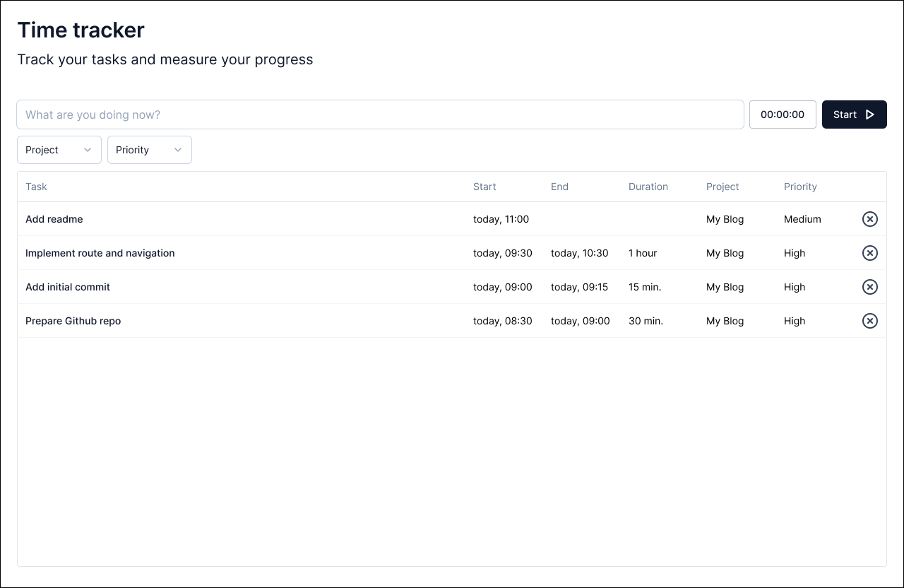

# Build Time Tracker app using Remix

📖 See the [Remix docs](https://remix.run/docs) and the [Remix Vite docs](https://remix.run/docs/en/main/future/vite) for details on supported features.

## Figma file

[Time Tracker design file](https://www.figma.com/file/Rg0YqzVFhWgtTaBpyUYcdw/Time-Tracker?type=design&node-id=103%3A1175&mode=design&t=PmPT59Q6PuIzbBR5-1)

## Development

Run the Vite dev server:

```shellscript
npm run dev
```

## Deployment

First, build your app for production:

```sh
npm run build
```

Then run the app in production mode:

```sh
npm start
```

Now you'll need to pick a host to deploy it to.

### DIY

If you're familiar with deploying Node applications, the built-in Remix app server is production-ready.

Make sure to deploy the output of `npm run build`

- `build/server`
- `build/client`
